# **Indistinct Light**

Indistinct Light was a photography project from late December 2020 to June 2021. It focused on images taken on the same route around the same time each night. One of the issues regarding the project was how to present the work to a wider audience when the majority of the work has never been in a gallery setting, and indeed many of the images remain virtual and have never been printed. A website for the project is the perfect solution.

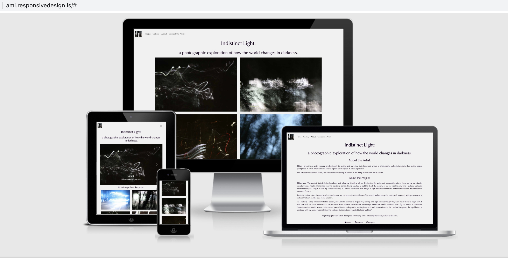

## Planning the Project Website:

### What is the Target Audience?

- Clients who have an interest in the artist's work and wanting to see more of it.
- Gallery owners/artist reps who wish to see the work prior to any commitments e.g. offering space within their gallery or promoting the artist.
- Other artists/creators who wish to see the work and work collaboratively together on future projects. 
- Photography enthusiasts who have an interest in the type of photography undertaken.
- Casual users who are not familiar with the artist's work or the type of work displayed here.

### Target Audience Requirements:

- As a user I would like to have more information about the project and artist.
- As a user I would like to be able to contact the artist directly.
- As a user I would like the site to not detract from the images.
- As a user I would like the site to be easy to navigate.

### Website Aims:

- To be a vehicle for advertising the skillset of the artist.
- To be a portal for users to learn more about the project.
- To be an ongoing promotional tool for the artist and project.
- To project a professional and considered image for the artist and project.
- To maintain high standards across all styling features.
- To provide interested users a way of contacting the artist directly.

**Other Considerations:**

- All images must be responsive across devices. The photographs will need to be re-sized to ensure the loading speed is not an issue.
- Explanations around the project and artist must be clear and succinct. The text is an essential part of explaining the work and therefore consideration must be taken in regards to the location, content, length and tone of any text on the site.
- Styling is an essential consideration - all elements regarding this - colour, font, links etc must be cohesive and consistent. 

### Ensuring the Aims and Considerations are Achieved:

A key part of the design was to keep in mind the website aims. Each part of the website needed to reflect a professional approach to promote the artist. To achieve this wireframes were used early on in the planning, to give a structured form of what the site structure needed to achieve. 

#### Wireframes

- [index wireframe](docs/index-wireframe.png)
- [gallery wireframe](docs/gallery-wireframe.png)
- [about wireframe](docs/about-wireframe.png)
- [contact wireframe](docs/contact-wireframe.png)

These were created to have a flexible approach in terms of the structure, as the design could be amended as needed during the creation of the site as the development of it progressed. 

As the site would be image heavy it was decided that creating additional wireframes to review mobile structure would not be needed as styling the images to resize was already a key factor in developing the site as a whole, and this would be continually reviewed throughout development.

It was also decided that four pages would be required - the home page, a gallery page, an about page and a contact page. This would keep the information about the project and artist on a separate page to the gallery, so the pages themselves would not feel cluttered and the focus of each was solely devoted to one area. 

### Colour Scheme

The colour scheme was kept as simple as possible. Using one of the images from the project, a colour was selected (using Adobe Photoshop tools) and then utilising the [coolers](https://coolors.co/) colour scheme generator a colour palette was created. It was decided to keep the colour scheme as simple as possible, as it was felt additional use of colour could detract from the overall impact of the site, and potentially could affect the website aims of making the site easy to navigate and ensuring the site looked as professional as possible. 

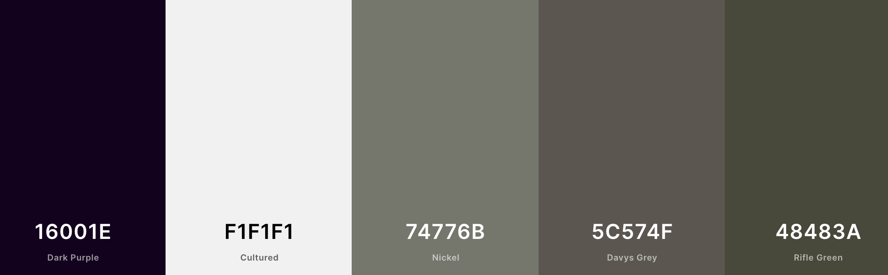

As part of this a decision was made to restyle the social media links in the footer of each page to ensure they reflected to chosen colour palette.

Also after some thought it was decided to stick to the first two colours and keep the remainder in reserve, should additional styling be required in the future. 

### Consistent Styling Across All Pages

**Header**

The header on all pages has a navigation bar with a logo. Clicking the logo takes the user back to the home page. The styling was kept as clean and simple as possible, with a light background. It also incorporates a collapse button to enable ease of navigation on smaller screen sizes. This style was felt to be contemporary and in keeping with the goals of creating a site that has a professional feel to it, and presenting it as one that would be familiar to all who access websites regularly on their mobile phones.

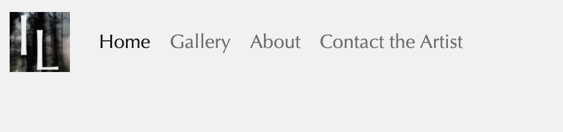

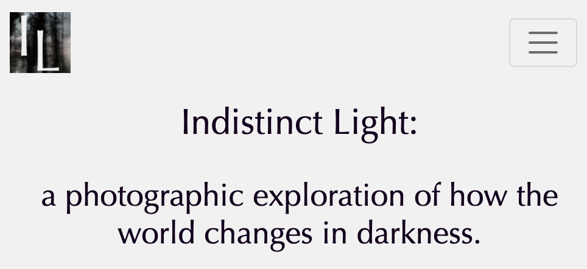

In terms of the content of the navigation with regards to the text included, it was felt the best approach would be to keep things simple so as not to clutter the screen, especially on smaller screens. 

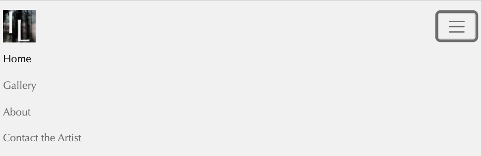

**Title and Subtitle**

h1 and h2 were used to display the project title and subtitle. This is used consistently across all pages, to create a cohesive approach. Whilst it was not necessary to do so, it was included on the contact page as it was felt this was more consistent with the rest of the site.

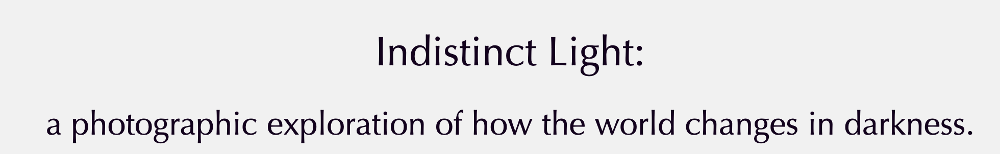

**Footer**

The footer contains social media links that launch in a new blank page. It was decided that Twitter, Pinterest and Instagram would be the most appropriate to use, as all three are often utilised by artists in sharing their work. All three have aria-hidden: true as this was thought to be the best approach. Also included is rel: no-referrer as a privacy enhancement.

**Other Notable Page Styling**

On the home, gallery and about pages an additional line of text sits above the footer. This was not included on the contact page as it was felt to be unnecessary for the page, as it does not contain any images other than the logo nor any information about the project other than the project title and subtitle.

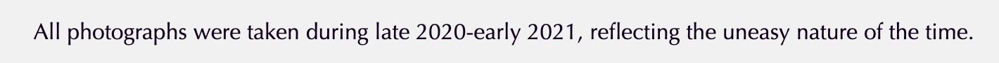

### Individual Page Styling

**Home Page**

The home page was kept simple. It was realised very early on that due to the complexity of the images in the project, including more visual items could detract from the feel of the whole project and therefore any ideas of including background images were dimissed early on in the planning stages. It was decided to use four images and some text as an introduction to the project. 

On desktop the images are in a grid system of two columns and two rows.

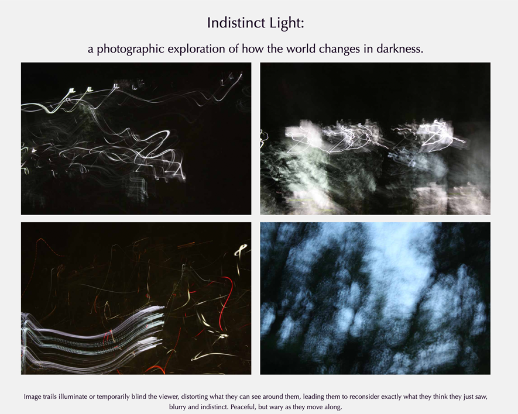

This then resizes to one image when viewed on a smaller screen. 

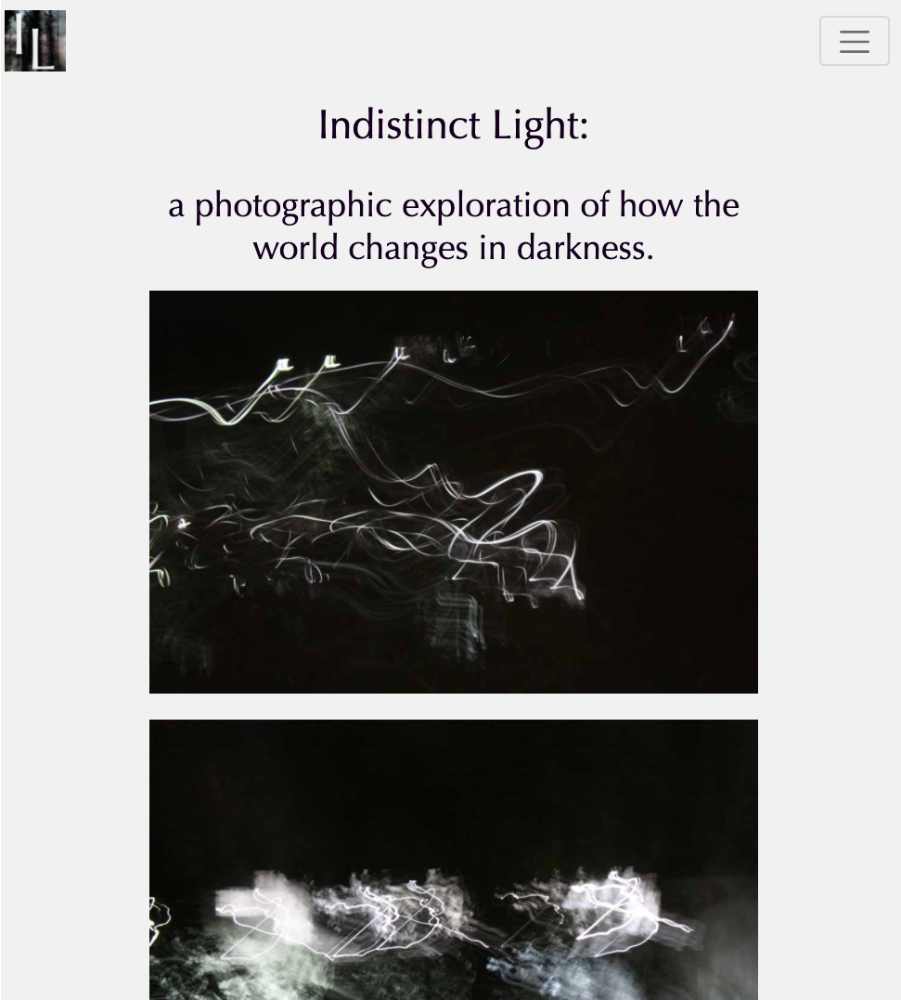

Styling of this page was consistently tested to ensure that the page met all the criteria in the website aims. Several ideas were discarded early on - including the previously mentioned idea of having a background image. The idea of a banner included in the original wireframe design was also excluded as this was felt that it could become a distraction. 

Four images were selected as it was thought more than this would be too much for the home page when there was a specific page for the gallery.

**Gallery Page**

The gallery page was recognised to be likely the most complex early on in the design of the site. It would be an image heavy page and there were a number of considerations regarding how best to display the photographs from the project. 

Originally it was thought that perhaps following the wireframe design of columns and rows would be best. However, it was quickly realised after this was tested that the images would suffer in that there would be no way of re-sizing the images to see them in greater detail if this design format was maintained. 

Various ideas in terms of resizing the columns and rows were considered. Also a way of the user clicking on an image and having it re-size to a larger size was also considered as an option. 

The choice of the carousel slide gallery meant that selected images could be larger on desktops and give an appealing look to the page, rather than just images that would be difficult to view in detail. In addition the carousel could also have text, creating a more dynamic site, and giviing the user a more interesting experience in viewing the images. 

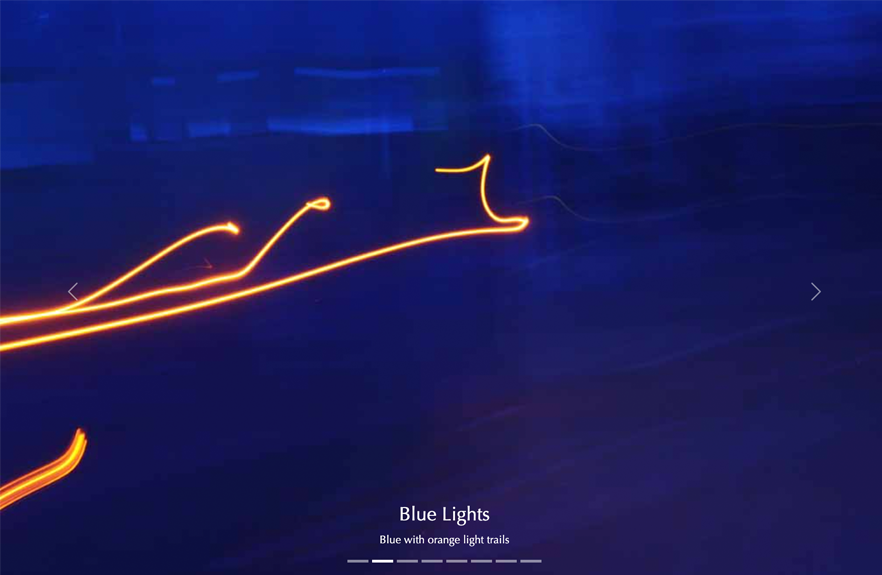
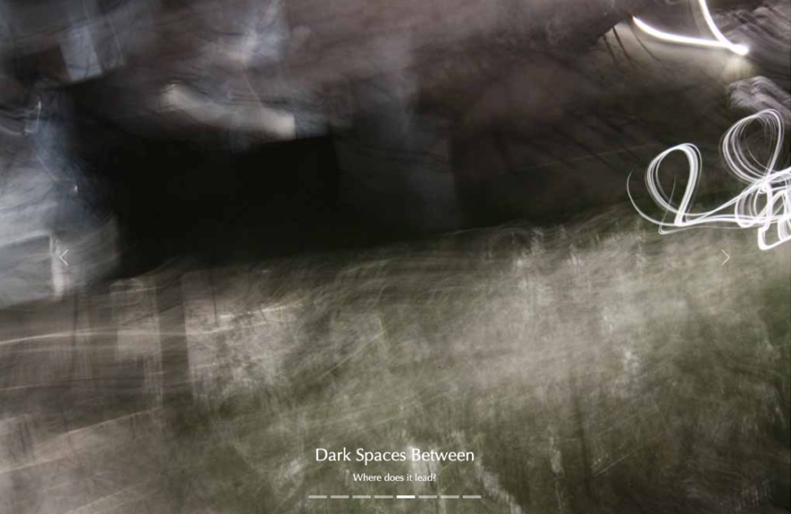

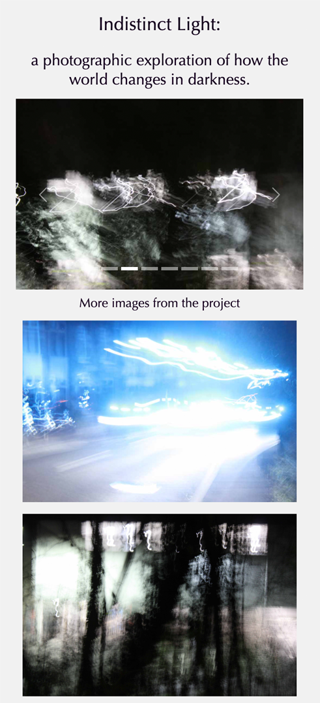

Originally it was thought that the carousel would be the only set of images on the page, but as the development continued it was decided that additional images could be displayed below the carousel. The same design criteria in terms of how many images would sit in a column was copied from the home page to keep the site design feeling consistent. However the number of rows were increased to differentiate between the two pages.

**About Page**

The about page was, in contrast to the gallery page's complexity, the most simple in terms of content. This was a page solely of text and therefore the key part of this was the textual content rather than any images, consequently the styling was kept as simple as possible. 

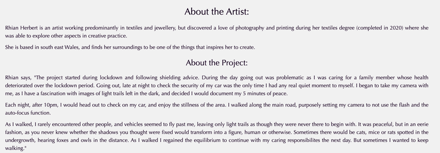

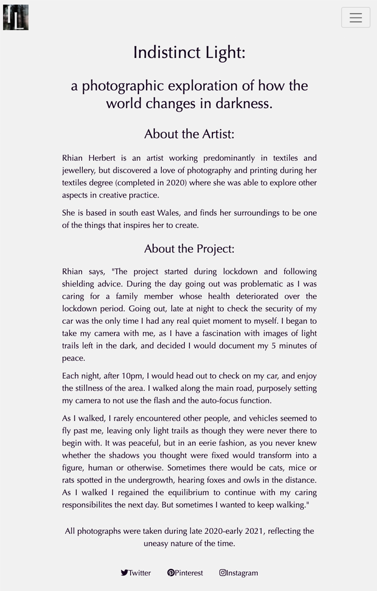

Other than keeping the styling consistent this page was kept clear from any images. It was considered whether to put an image of the artist and potentially another image from the project on the page, but it was felt that the page's simplicity worked well in terms of explaining the project and therefore it did not need any additional features.

**Contact Page**

The contact page was also devoid of any images. It was decided to keep the same feel on this page in conjuction with the about page - as it would mean there would not be one page that in particular stood out for not having the same things as the others. The only difference on this page of course is the previously mentioned lack of a line of text above the footer. 

The contact page on desktop

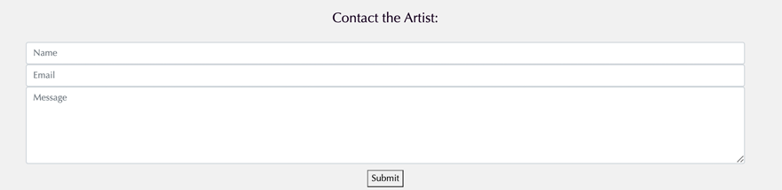

The line of text was not included as it was felt it would detract from the submit button below the contact form.

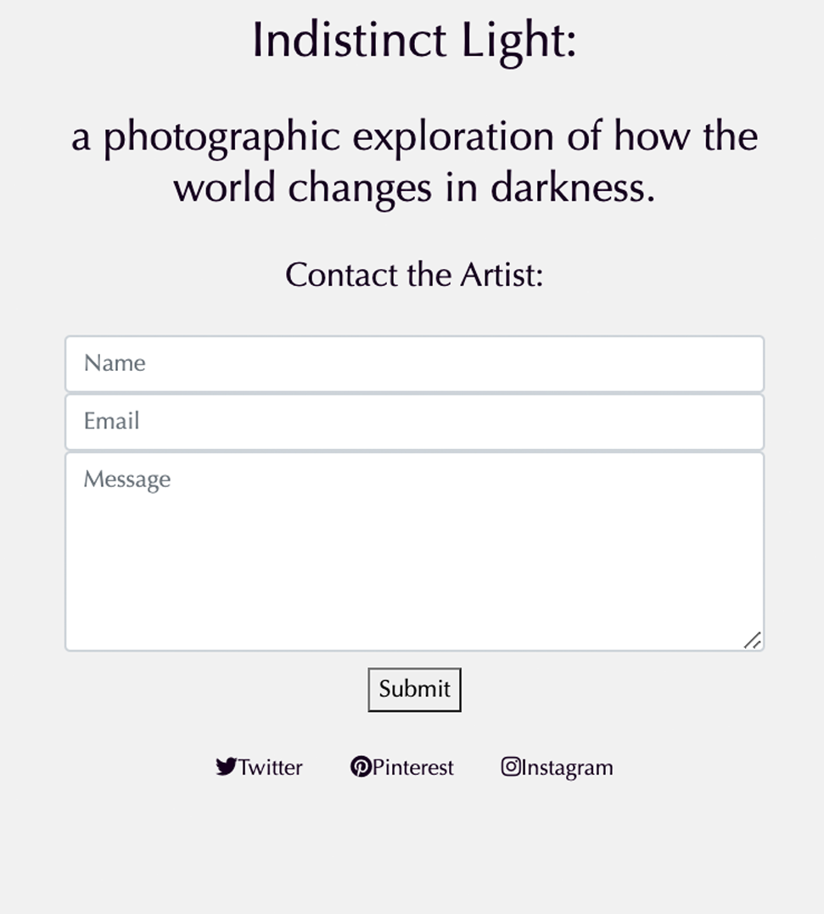

The submit button is simply styled. Other styles were tried, however none seemed to keep the same feel in terms of style that the submit button has in it's current form. It echoes the text above the contact form and also below with the social media buttons and consequently it was decided to keep the button in its original form as it was better suited to the look of the whole page.

## CSS Styling

The CSS for the site was limited in terms of amount. As the design of the site was kept as simple as possible the number of classes required for styling is minimal. The colour scheme and font styling are consistent across the individual pages and consequently, little styling was required other than to ensure that text and images were appropriately sized and were responsive depending on what device the user had to view the site. 

Some code within the stylesheet was discussed with my mentor as it appears to duplicate itself, specifically the text styling, gallery and index images. However, I felt it was best to keep these with separate classes so that if there were future amendments that were required, the css was already set up to accommodate changes in this way.

CSS was continually worked on during the development of the site. Pixels were changed to rem as this ensured more consistent sizing for the fonts. Testing was undertaken throughout the process.

## Testing

Testing the code was a continual process and edits were made throughout the site's development. Issues occurred with the sizing of images, which was noticed when different screen sizes were trialed. Code was amended to ensure that these were not going to be future issues. During the development, each stage was checked prior to moving on to adding additional code so as to be sure that what had already been written was working before any new changes were made.

The contact form was re-sized as originally it was the width of the screen and this was not in keeping with the remainder of the pages. Consequently it was restyled.

As there is only a small amount of CSS this was relatively easy to check. Errant code was cleaned regularly so as not to affect the correct code.

A modal was added to trial a pop up style window for the images in the gallery, however this did not work as well as was hoped and therefore the code was removed and the carousel was added instead.

During discussions with my mentor Richard an amendment to the code for the carousel was suggested. However, on trialling this at a later point it affected the overall useability and consequently I reverted the code back to the original.

Changes to the code were committed regularly and notes were added to clarify what the changes were.

## Validation

The pages passed validation checks after a few amendments - including one where the DOCTYPE had been let off 3 of the pages! After updating this only minor elements needed amending including a space between the aria labelling in the footer as it did not have one between that and the i class. testing with both css and html trialled during the development stages so any minor errors were picked up earlier in the process and corrected. Towards the end of the work Lighthouse was also used to check the site.

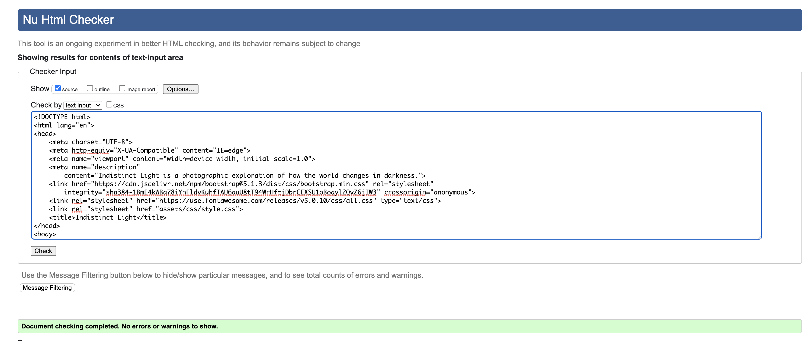
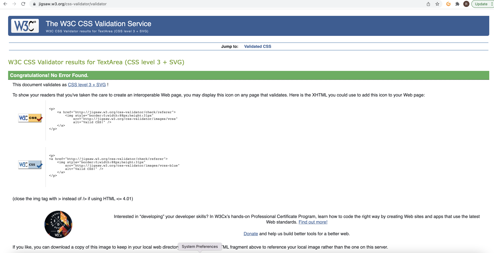
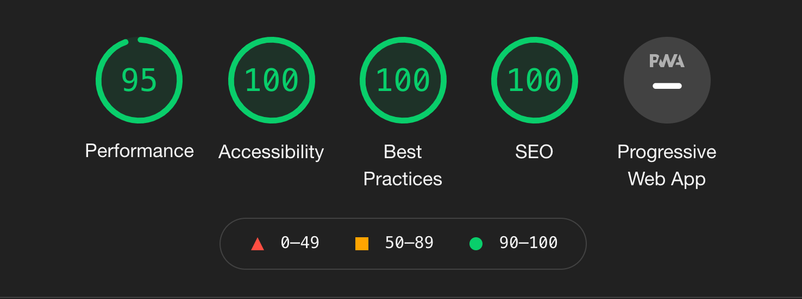

## Deployment

Deployment was via Github pages. This was tested in advance prior to the finished design as part of the testing of the site and learning the use of Github in general.

## Future Updates:

I would like to continue adding images and potentially develop both the project and the site.

I would like to explore what other functionality I could include by using javascript as I could see what this could offer, but did not have the current skillset to utilise. 

There is capacity for more work to be created as a stage 2 of the Indistinct Light project as a contrast to the original work. The site also has the capacity for development as it could incread in terms of number of pages, more information about the project, more images and also links to other work by myself.

## Credits 

**Honorable mentions:**

A huge thank you to my mentor Richard without whom this project would not have progressed forward.

The community on Slack who unknowingly assisted by asking questions months before I began this project, and the answers therein I found invaluable.

**Other references:**

This site was created following the completion of the Love Running project and the modules on HTML and CSS by the Code Institute. This helped me design my own pages, and any similarities in code are accidental.
I have used Bootstrap during this project, along with the validators for CSS and HTML. 

**Content:**

- Icons in the footer were taken from [Font Awesome](https://fontawesome.com/)
- Font style chosen was the standard Optima as stylistically it suited the project. 
- All content and images were created by myself.

