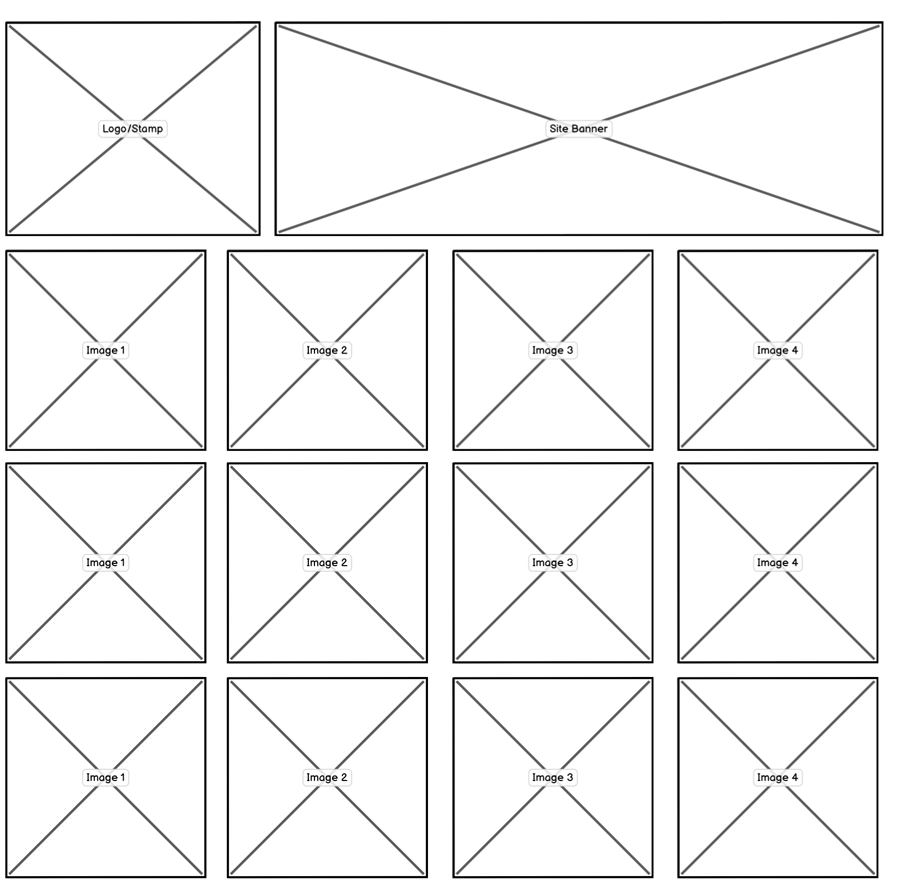
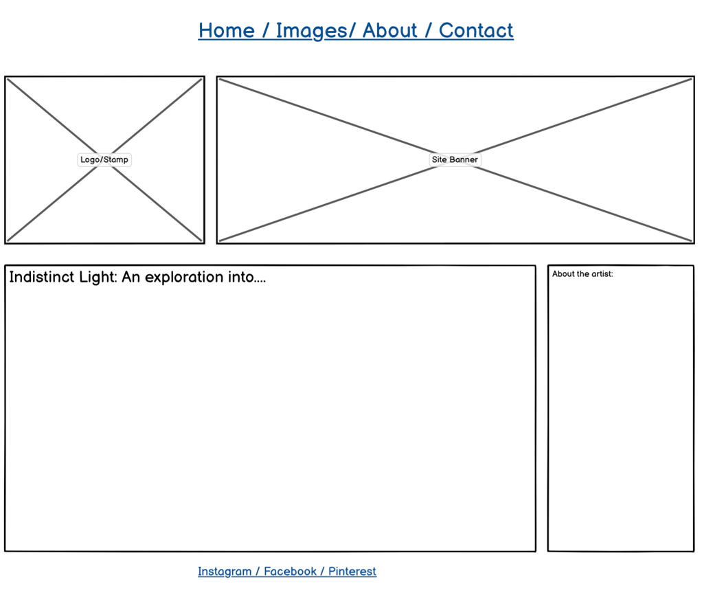
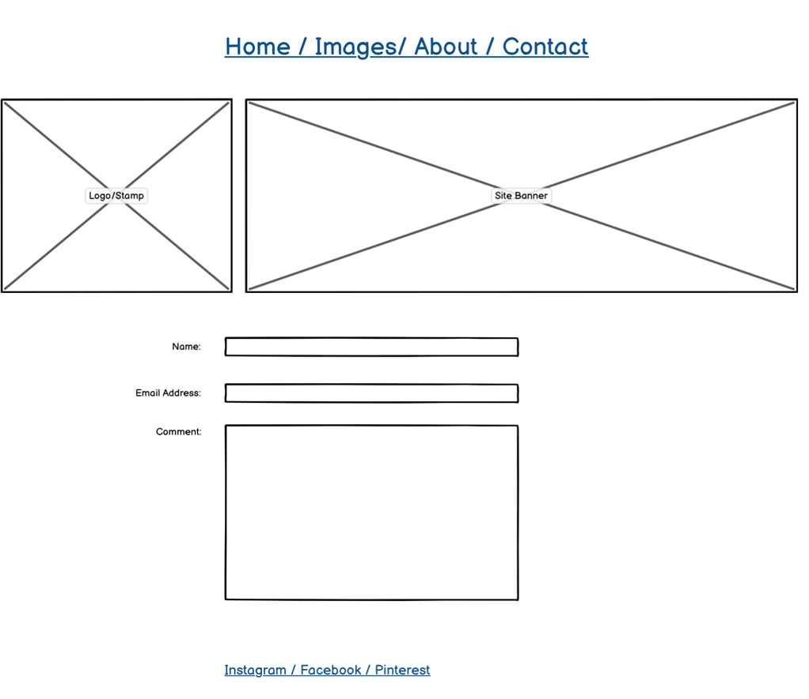

# **Indistinct Light**

Indistinct Light was a photography project from late December 2020 to June 2021. It focused on images taken on the same route around the same time each night. One of the issues regarding the project was how to present the work to a wider audience when the majority of the work has never been in a gallery setting, and indeed many of the images remain virtual and have never been printed. A website for the project is a perfect solution.

## **Contents:**

## Planning the Project Website:

### What is the Target Audience?

- Clients who have an interest in the artist's work and wanting to see more of it.
- Gallery owners/Artist reps who wish to see the work prior to any commitments e.g. offering space within their gallery or promoting the artist.
- Other artists/creators who wish to see the work and work collaboratively together on future projects. 
- Photography enthusiasts who have an interest in the type of photography undertaken.
- Casual users who are not familiar with the artist's work or the type of work displayed here.

### Target Audience Requirements:

- As a user I would like to have more information about the project and artist.
- As a user I would like to be able to contact the artist directly.
- As a user I would like the site to not detract from the images.
- As a user I would like the site to be easy to navigate.

### Website Aims:

- To be a vehicle for advertising the skillset of the artist.
- To be a portal for users to learn more about the project.
- To be an ongoing promotional tool for the artist and project.
- To project a professional and considered image for the artist and project.
- To maintain high standards across all styling features.
- To provide interested users a way of contacting the artist directly.

**Other Considerations:**

- All images must be responsive across devices. The photographs will need to be re-sized to ensure the loading speed is not an issue.
- Explanations around the project and artist must be clear and succinct. The text is an essential part of explaining the work and therefore consideration must be taken in regards to the location, content, length and tone of any text on the site.
- Styling is an essential consideration - all elements regarding this - colour, font, links etc must be cohesive and consistent. 

### Ensuring the Aims and Considerations are Achieved:

A key part of the design was to keep in mind the website aims. Each part of the website needed to reflect a professional approach to promote the artist. To achieve this wireframes were used early on in the planning, to give a structured form of what the site structure needed to achieve. 

#### Wireframes

These were created to have a flexible approach in terms of the structure, as the design could be amended as needed during the creation of the site as the development of it progressed. 

As the site would be image heavy it was decided that creating additional wireframes to review mobile structure would not be needed as styling the images to resize was already a key factor in developing the site as a whole, and this would be continually reviewed throughout development.

It was also decided that four pages would be required - the home page, a gallery page, an about page and a contact page. This would keep the information about the project and artist on a separate page to the gallery, so the pages themselves would not feel cluttered and the focus of each was solely devoted to one area. 

### Colour Scheme

The colour scheme was kept as simple as possible. Using one of the images from the project, a colour was selected (using Adobe Photoshop tools) and then utilising the coolers website a colour palette was created. It was decided to keep the colour scheme as simple as possible, as it was felt additional use of colour could detract from the overall impact of the site, and potentially could affect the website aims of making the site easy to navigate and ensuring the site looked as professional as possible. 

As part of this a decision was made to restyle the social media links in the footer of each page to ensure they reflected to chosen colour palette.

Also after some thought it was decided to stick to the first two colours and keep the remainder in reserve, should additional styling be required in the future. 

### Consistent Styling Across All Pages

The header on all pages has a navigation bar with a logo. Clicking the logo takes the user back to the home page. The styling was kept as clean and simple as possible, with a light background. It also incorporates a collapse button to enable ease of navigation on smaller screen sizes. This style was felt to be contemporary and in keeping with the goals of creating a site that has a professional feel to it, and presenting it as one that would be familiar to all who access websites regularly on their mobile phones.

Desktop Navigation

Mobile Navigation

h1 and h2 were used to display the project title and subtitle. This is used consistently across all pages, to create a cohesive approach. It was included on the contact page as it was felt this was more consistent with the rest of the site.

The footer contains social media links that launch in a new blank page. It was decided that Twitter, Pinterest and Instagram would be the most appropriate to use, as all three are often utilised by artists in sharing their work. All three have aria-hidden: true as this was thought to be the best approach. Also included is rel: no-referrer as a privacy enhancement.

**Other Notable Page Styling**

On the home, gallery and about pages an additional line of text sits above the footer. This was not included on the contact page as it was felt to be unnecessary for the page, as it does not contain, any images other than the logo nor any information about the project other than the project title and sibtitle.

### Individual Page Styling

